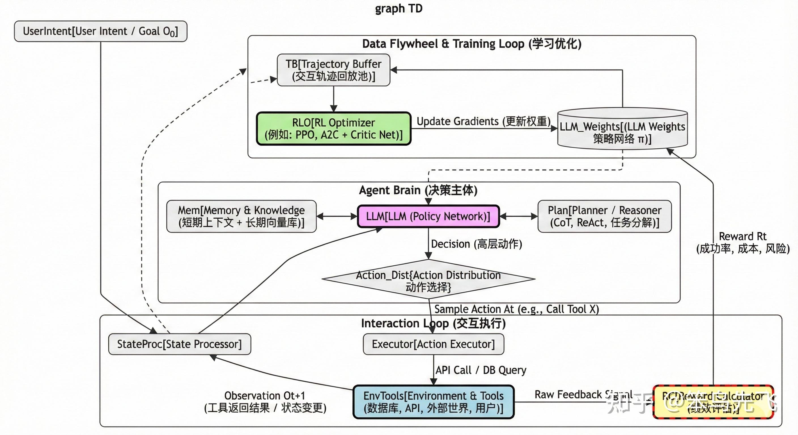

# Agentic RL

Agent 化的强化学习相关框架、多 agent 训练系统、以及把 RL 应用到 agent / multi-LLM 场景的资料与笔记。

## 论文 & blog

| # | 标题 | 链接 | 笔记 |
|---|------|------|------|
| 1 | 知乎 — Agentic RL 综述（state/action/env/reward 框架） | [zhuanlan.zhihu.com/p/1985054130469888615](https://zhuanlan.zhihu.com/p/1985054130469888615) | 见下方 Introduction |
| 2 | 知乎 — Agentic RL 时代的 Infra 重构：以Forge、ROLL、Seer 、Slime为例 | [zhuanlan.zhihu.com/p/2022786148087464077](https://zhuanlan.zhihu.com/p/2022786148087464077) | *待补充笔记* |

## 代码仓库

| # | 名称 | 仓库 | 笔记 |
|---|------|------|------|
| 1 | agent-lightning — Microsoft 出品的 agent RL 训练框架 | [microsoft/agent-lightning](https://github.com/microsoft/agent-lightning) | [agent-lightning.md](repos/agent-lightning.md) |
| 2 | MARTI — 清华 C3I 的 multi-agent RL 训练基础设施 | [TsinghuaC3I/MARTI](https://github.com/TsinghuaC3I/MARTI) | [marti.md](repos/marti.md) |
| 3 | PettingLLMs — multi-LLM agent 训练 / 评估框架 | [pettingllms-ai/PettingLLMs](https://github.com/pettingllms-ai/PettingLLMs) | [pettingllms.md](repos/pettingllms.md) |
| 4 | CoMLRL — Cooperative multi-LLM RL | [OpenMLRL/CoMLRL](https://github.com/OpenMLRL/CoMLRL/) | [comlrl.md](repos/comlrl.md) |

## Introduction

来源：[知乎专栏 — Agentic RL 综述](https://zhuanlan.zhihu.com/p/1985054130469888615)

这里的「Agent」指的是把传统 RL 的"状态–动作–环境–回报"框架套到 LLM 上：

- **状态 $s$**：环境信息 + Agent 内部记忆（history、工具输出、数据库状态……）
- **动作 $a$**：不再只是"下一个 token"，而是——选择工具、构造 SQL / API 调用、规划子任务、决定是否继续对话、是否写入知识库等等
- **环境 $E$**：真实的数据库、Web API、用户、任务队列、文件系统……会随着动作变化
- **回报 $r$**：和任务成功率、延迟、成本、用户满意度、安全约束相关
- **策略 $\pi$**：可以由 LLM + 工具组成，但 RL 优化的是「整个决策流程」

一句话总结：**Agentic RL = 在"状态–动作–环境反馈"这个闭环上做 RL，LLM 只是这个闭环里实现策略的一部分**。

这时候 LLM 不再仅仅是"嘴巴"（生成文本），而是成了"大脑"（决策中心）——它通过操纵"四肢"（工具 / API）与"世界"（环境）交互，并根据"绩效指标"（reward）来优化自身的决策逻辑。

## LLM-RL vs Agentic-RL

**环境 & 交互形式**：LLM-RL 的环境基本是静止的——给一个 prompt、吐一段回答、结束；reward 只在 episode 终点给一次（整条回答一个分），不存在"对同一个任务多轮试错"。Agentic-RL 的环境是动态的——查询数据库会改变上下文，调 API 可能改变外部世界，用户下一句话取决于你刚刚的回答；回合很长、多步骤多工具多轮对话，必须靠 trial-and-error 去发现更好的策略。

**行动粒度 & 信用分配**：LLM-RL 的行动粒度是 token 或整段回答，reward 通常只在最后给一次，信用分配基本是"把奖励摊到所有 token 上"，最多用 GAE 平滑一下。Agentic-RL 的行动是高层决策——调用哪个 tool、读哪张表、如何拆子问题、是否结束任务；reward 可以在流程中的多个关键节点发，信用分配能精确到"哪一步决策让任务走向成败"。对数据 / 工具 agent 来说真正重要的是"每一步选的工具和操作是否对任务有贡献"——只对最终回答打个分再 PPO 一下，是学不到东西的。

**优化目标：输出分布 vs 任务绩效**：LLM-RL 的目标多是"对齐"，停留在"给定 prompt + 一次回答"的框架里，reward 模型学的是"用户更喜欢哪种回答"。Agentic-RL 的目标更接近系统级 KPI——成功率、成本（调用次数 / API 费用 / 延迟）、稳定性 & 安全性，常是多目标加权 $R = \alpha \cdot \text{成功率} - \beta \cdot \text{成本} - \gamma \cdot \text{风险}$。换句话说，LLM-RL 优化的是"回答好不好"，Agentic-RL 优化的是"整个系统做事情做得好不好"。

**数据来源 & 学习范式**：典型 RLHF 是"离线数据 + 少量在线采样"，主数据是标注好的偏好对，环境不变——很多时候更像"加了 KL 正则的监督学习"（DPO、IPO 等）。Agentic-RL 必须和环境**长期在线交互**才能形成 data flywheel：收集成功/失败信号、用户显式/隐式反馈，on-policy 或 off-policy 地持续更新策略；自然就会撞上探索、分布偏移、off-policy 修正这些"正统 RL"问题。

**一句话总结**：LLM-RL 优化「一次性吐答案的质量」，Agentic-RL 优化「多步交互过程本身」——前者是对话补全，后者是带反馈循环的决策系统。

> why Agentic RL is necessary ? 总结一下，传统的 LLM RL（例如 PPO-based RLHF）本质上仍然是一种“分布对齐”技术：它在离线偏好数据和静态 prompt 环境中，调整语言模型的输出概率分布，使单轮回答更符合人类偏好。然而，在现实应用中，真正具有商业价值的智能系统往往是 Agent 化的：它们需要在一个动态环境中进行多步决策、调用多种工具、维护长期记忆，并对任务成功率、成本、安全约束等系统级指标负责。这种情况下，仅仅针对单轮输出做 LLM RL 已经不够，我们需要将 RL 扩展到整个 “状态–动作–环境反馈” 的闭环上，用 Agentic RL 直接优化智能体的行为策略。换言之，LLM RL 让模型“说得更好”，而 Agentic RL 让系统“做得更好”；只有两者结合，才能支撑未来复杂的数据智能体和企业级 Agent 应用。
