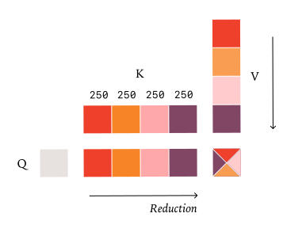
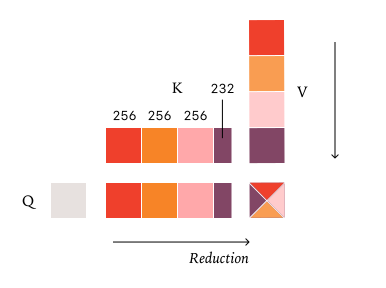
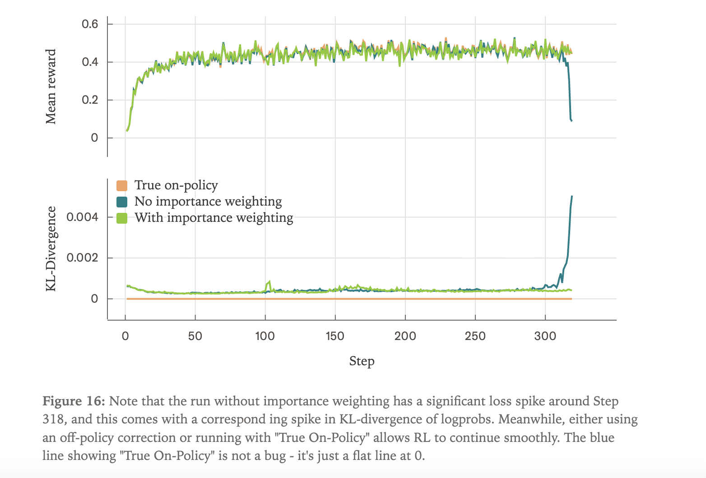

# thinking-machines-lab/batch_invariant_ops

- 仓库：[thinking-machines-lab/batch_invariant_ops](https://github.com/thinking-machines-lab/batch_invariant_ops)

batch 不变性算子，用于推理数值一致性。

## Defeating Nondeterminism in LLM Inference
**A walkthrough of Horace He & Thinking Machines Lab's blog post**

https://thinkingmachines.ai/blog/defeating-nondeterminism-in-llm-inference/#true-on-policy-rl

### 1. The Puzzle: Why Are LLMs Nondeterministic Even at Temperature 0?
Anyone who has used ChatGPT knows that asking the same question twice often yields different answers. We typically blame this on sampling randomness, so the natural fix is to set temperature = 0 (greedy sampling — always pick the highest-probability token). In theory, this should make outputs perfectly reproducible. But it doesn't. Even with temperature = 0, even when you run inference yourself on your own GPU using vLLM or SGLang, the outputs still vary across runs. Why? This blog sets out to answer that question — and the answer turns out to be much subtler than the conventional explanation suggests.

### 2. The Conventional (and Wrong) Explanation: "Concurrency + Floating Point"
The most popular hypothesis in the community goes like this:

"GPUs are massively parallel. Floating-point addition isn't associative — (a+b)+c ≠ a+(b+c). So when concurrent threads finish in nondeterministic order and accumulate into a shared sum (via atomic adds), you get nondeterministic results."

This explanation appears in arXiv preprints, blog posts, and Stack Overflow answers everywhere. It sounds technical and authoritative.
Horace shows it's wrong — at least for LLM inference — with a single counter-example:
```
A = torch.randn(2048, 2048, device='cuda', dtype=torch.bfloat16)
B = torch.randn(2048, 2048, device='cuda', dtype=torch.bfloat16)
ref = torch.mm(A, B)
for _ in range(1000):
    assert (torch.mm(A, B) - ref).abs().max() == 0  # always passes!
```
If "concurrency + floating point" were the real cause, this test should fail. The GPU is parallel; floating-point math is involved. Yet torch.mm returns bitwise-identical results 1000 times in a row. So the conventional story is missing something.
The reason: modern GPU kernels for LLMs almost never use atomic adds. They use split reductions, tree reductions, or other deterministic strategies that achieve parallelism without sacrificing reproducibility. So GPU concurrency, by itself, is not the source of LLM nondeterminism.


### 3. The Real Culprit: Lack of Batch Invariance
If the kernels themselves are run-to-run deterministic, why is LLM inference nondeterministic? Horace's key insight:

> LLM kernels are deterministic given a fixed input — but their output depends on the batch size they're run under.

This property is called batch invariance (or rather, its absence). A simple PyTorch demonstration:

```
out1 = torch.mm(a[:1], b)        # process just row 0
out2 = torch.mm(a, b)[:1]        # process whole batch, take row 0
print((out1 - out2).abs().max()) # tensor(1669.25) huge difference!
```

Mathematically, row 0's output should be identical regardless of whether we batch it with other rows. But GPU matmul kernels switch internal strategies based on batch size — different tiles, different reduction orders, different tensor-core instructions — so the floating-point output drifts.
**Why this makes LLM serving nondeterministic for users:** When you query an inference server, you don't know how many other people are simultaneously querying it. The server's load determines the batch size your request gets folded into, which determines which kernel path runs, which determines your exact output. From the server's perspective it's deterministic; from your perspective it's not.
This is why the nondeterminism isn't unique to GPUs — CPU- or TPU-served LLM endpoints have the same problem.


### 4. The Fix: Making Three Critical Kernels Batch-Invariant

A transformer's forward pass uses three reduction-heavy operations. To get fully reproducible inference, all three must be made batch-invariant. Horace presents them in increasing order of difficulty.

#### 4a. RMSNorm (the easy case)
The natural strategy is data-parallel: assign one row to one core, perform the reduction entirely within that core. As batch size grows, just have each core handle multiple rows sequentially — the reduction order per row never changes. Batch invariance is preserved for free.

The problem: when batch size is small, you have idle cores. A kernel engineer would normally fix this by splitting the reduction across cores — but that changes the reduction order and breaks batch invariance.

Fix: Just don't split. Small batches are inherently fast, so the performance loss from leaving cores idle is acceptable.

#### 4b. Matrix Multiplication (the medium case)
Same data-parallel principle: chunk the output into 2D tiles, give one tile to each core. Two extra wrinkles:

Tensor cores require large tiles ([128, 128] is standard) to be efficient. So even if M and N look "big" mathematically, they may not generate enough tiles to saturate the GPU.
When tiles run out, kernels fall back to Split-K (splitting the reduction dimension) — which breaks batch invariance.
At extremely small batch sizes (e.g., M = 1 in decoding), kernels may switch to smaller tensor-core instructions or even bypass tensor cores entirely. Each switch breaks invariance.

Fix: Compile a single kernel configuration and use it across all shapes, accepting ~20% performance loss vs. cuBLAS. In LLM inference this isn't disastrous, since the model dimension N is usually large enough that Split-K rarely kicks in

#### 4c. Attention (the hardest case)
Attention is the toughest because it contains two matmuls and reduces over both the feature dimension and the sequence dimension — and it interacts with inference-engine optimizations like chunked prefill, prefix caching, and paged KV cache.

**Problem 1:** Inconsistent KV layout. vLLM's old kernel processes KV cache and current K/V as two separate segments. When the same query token is processed in prefill (everything in current) versus decoding (everything in cache), the kernel splits the data into a different number of blocks (e.g. 8 vs. 9), which changes the reduction order.

**Fix:** Write current K/V into the KV cache before the attention kernel runs, so the kernel always sees a single, consistently-laid-out block of data — independent of which inference stage produced it.

**Problem 2:** Split-KV (FlashDecoding). During decoding, query length is 1, so parallelism along Q is essentially zero. With long KV caches, a single core would take forever. Engines therefore split the KV dimension across cores — **but the standard strategy ("fixed number of splits") gives different per-split sizes for different KV lengths, breaking invariance.**

**Fix:** Fixed split size, not fixed split count. Always use chunks of e.g. 256 elements. The number of chunks varies with KV length, but each chunk's internal reduction is always the same. Reduction order is preserved regardless of how many query tokens are being processed.

<table>
<tr>
<td></td>
<td></td>
</tr>
<tr>
<td align="center"><sub>修复前：fixed split count（4×250），KV 长度变 → 每块大小变</sub></td>
<td align="center"><sub>修复后：fixed split size（256/256/256/232），归约顺序不变</sub></td>
</tr>
</table>

### 5. Implementation and Empirical Validation
Determinism test: With Qwen3-235B at temperature 0, the prompt "Tell me about Richard Feynman" generates 80 different completions across 1000 runs with default vLLM. They all agree for the first 102 tokens, then diverge — most produce "Queens, New York", a few produce "New York City". With batch-invariant kernels enabled: all 1000 completions are bitwise identical.

Performance cost: Generating 1000 sequences on a single GPU running Qwen-3-8B takes 26s with default vLLM, 42s with the optimized batch-invariant version, 55s without further optimization. Roughly 1.6× slower — usable, not optimal. Most of the slowdown is a not-yet-optimized FlexAttention integration, not a fundamental ceiling.

### 6. The Big Payoff: True On-Policy RL
The most important application — and where this work has real research impact — is in RLHF training.
The problem RL practitioners have been quietly tolerating: Sampler (vLLM) and trainer (PyTorch) compute logprobs through different forward-pass implementations. The numerical mismatch is small (KL divergence ~0.001) but persistent. This means RL algorithms that believe they're on-policy are actually subtly off-policy. The standard workaround is importance weighting — multiplying each sample by π_trainer / π_sampler to correct for the discrepancy.
Horace's experiments on BigMath with Qwen 2.5-VL 8B compare three configurations:

- Without importance weighting: Reward trains smoothly for a while, then collapses catastrophically — accompanied by a sudden KL spike. The numerical drift accumulates until the gradient direction goes badly wrong.
- With importance weighting: Training is stable. KL hovers around 0.001 with occasional spikes. This is the standard RLHF setup today.
- True on-policy (batch-invariant kernels in both sampler and trainer): KL divergence is exactly 0 throughout training. No importance weighting needed. Training is stable.

In other words: batch invariance lets us drop the importance-weighting term entirely and recover truly on-policy RL. This simplifies algorithms (PPO's `min(ratio·A, clip(ratio)·A)` collapses back to a vanilla policy gradient), removes a hyperparameter (clip range), and makes training fundamentally more stable.


