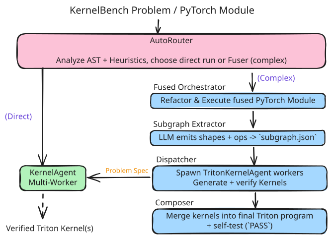
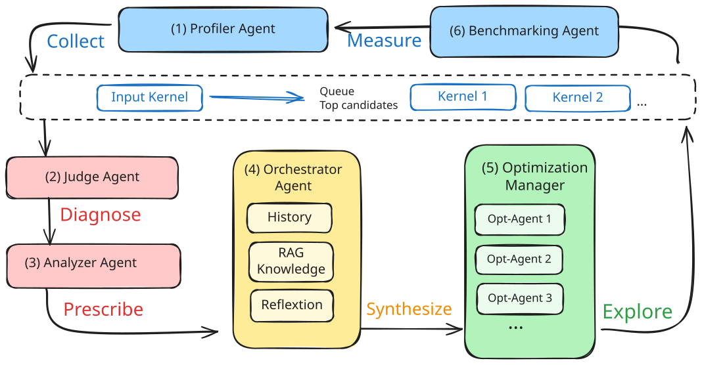

# meta-pytorch/KernelAgent

- 仓库：[meta-pytorch/KernelAgent](https://github.com/meta-pytorch/KernelAgent)

Meta PyTorch 出品的 kernel 生成 agent：从 PyTorch 程序自动产出 *已验证* 的 Triton kernel，再做硬件感知的性能优化。

## Part 1 — 整个流水线怎么转

KernelAgent 本质是一条 **「PyTorch 程序 → 多个 Triton kernel → 拼回完整程序」** 的多 agent 流水线。从外到内有 3 层。



**最外层：AutoRouter 路由**。`Fuser/auto_agent.py` 用 AST 静态扫一遍输入：碰到 attention block、转置卷积、控制流、长 op 链，就走"完整 Fuser 流水线"；否则把整个问题当一个 kernel 直接交给内层 agent。决策结果落到 `.fuse/router_cache.json`，下次同问题不再算；而且支持失败 fallback（直接路径挂了换 Fuser，反之亦然）。

**中间层：Fuser 流水线（针对复杂模型）**。`Orchestrator` 先把 PyTorch 模型重写成可融合模块并跑一遍等价性检查；`SubgraphExtractor` 调 LLM 输出 `subgraphs.json`，把整张图切成若干独立子图，再用 shape signature 去重（同形状只生成一次）；`Dispatcher` 把每个子图作为一份"problem spec"喂给一个 `TritonKernelAgent` 实例并发跑（默认 `ThreadPoolExecutor` + 每个线程内 4 个进程）；最后 `Composer` 把所有验证过的 kernel 拼成一个 `composed_kernel.py` 并跑端到端等价性测试。每一步的产物都落到 `.fuse/<run_id>/` 下的不同子目录，断点续跑友好。

**最内层：单个 kernel 的 agent loop**。这是流水线里被反复调用的子程序。`TritonKernelAgent.generate_kernel()` 收到一个问题描述后：① 先用 `test_generation.j2` 模板让 LLM 写一份测试代码；② 用 `kernel_generation.j2` 模板生成 N 个 kernel seed（provider 支持就一次拿 N 份，否则循环 N 次配不同 temperature）；③ 把 N 个 seed 交给 `WorkerManager`，对每个 seed 在独立 tempdir 里 fork 一个 `VerificationWorker` 进程；④ 每个 worker 在自己进程里跑"写 kernel → subprocess 跑测试 → 把 stderr+history 喂回 LLM 让它改"的小循环，最多 `max_rounds`（默认 10）轮；⑤ 用 `mp.Event` 做"谁先 PASS 大家就停"的同步——任意一个 worker 退出码 0，event set，其他 worker 立即 return。

**外层 vs 内层的"并行"语义不同**：Fuser 的并行 = 不同问题（子图 A/B/C 同时被解），agent loop 的并行 = 同一个问题（4 个 seed 抢答）。所以 Dispatcher 起 4 线程 × 每线程 4 worker，实际并发 ~16 个 Python 子进程。

**优化流水线（独立的第二条主线）**。`triton_kernel_agent/opt_worker.py` + `kernel_perf_agent/` 跑一个 6 步硬件感知循环：NCU 采 28 个指标 → roofline 把 kernel 分类成 memory/compute/under-util → LLM 诊断瓶颈 → 从知识库（TMA / persistence / PID swizzle 等代码样例）检索"对症"技巧塞进 prompt → LLM 改 kernel → 数值验证 + benchmark；SOL ≥ 95% 或最近 5 轮波动 < 0.1% 就早停。这条优化循环里的"数值验证"那一步复用的就是上面 agent loop 里的 verification 接口。



**一个"硬"约束：防止 LLM 偷懒**。`worker.py` 顶部一长串 `DISALLOWED_TORCH_PATTERNS` 正则，禁止生成的 kernel 出现 `torch.matmul/mm/bmm/einsum`、`torch.nn`、`F.*`、`torch.ops.aten`、`inspect`、`sys._getframe` 等——必须真的写 Triton。检测命中直接当 violation，塞进 refinement 反馈让 LLM 下一轮改。

## Part 2 — Verification 是怎么做的

这是这个 repo 最值得抄的部分。Verification 不是单一一段代码，而是分布在 5 个地方、5 个层级。从"判定算对没"到"防作弊"再到"进程隔离"，每层都有可复用的设计。

### 2.1 数值正确性的核心：`examples/optimize_*/test.py`

这是真正"算对没"的代码，标准结构：

```python
def test_kernel():
    device, dtype = "cuda", torch.bfloat16

    # 1) 原 PyTorch Model 当 reference
    model = Model(*get_init_inputs()).to(device).to(dtype)
    inputs = [...]
    with torch.no_grad():
        ref_output = model(*inputs)

    # 2) 自适应 binding：用 inspect.signature 看 kernel 想要什么参数
    sig = inspect.signature(kernel_function)
    # 看签名里有 weight / stride / eps / num_groups 就走"参数注入"路径
    kernel_output = kernel_function(...)

    # 3) 形状/dtype 对齐
    if kernel_output is None:                       # in-place kernel
        kernel_output = inputs[0]
    if ref_output.dim() == 0 and kernel_output.dim() >= 1:
        kernel_output = kernel_output.mean()        # reference 是 loss(标量), kernel 是 per-sample
    if ref_output.dtype != kernel_output.dtype:
        # 不直接 cast：用更高精度重算 reference, 避免 bf16→fp32 cast 不公平
        ...

    # 4) 真·正确性判断
    if torch.allclose(ref_output, kernel_output, rtol=1e-2, atol=1e-2):
        print("PASS"); return True
    else:
        print(f"FAIL: max diff = {(ref_output - kernel_output).abs().max().item()}")
        return False

if __name__ == "__main__":
    sys.exit(0 if test_kernel() else 1)             # 退出码 = pass/fail
```

四个工程化细节：
- **`inspect.signature` 自适应 binding**：不假设参数顺序，看签名里的关键字决定怎么传。
- **shape mismatch 自动 reduce**：reference 是标量、kernel 是 per-sample 时自动 `.mean()` 对齐。
- **dtype mismatch 用"提精度"而不是"降精度"**：避免把 kernel 输出 cast 到 bf16 去跟低精度 reference 比，造成不公平。
- **退出码即真值**：不解析 stdout，subprocess 天然兼容。

### 2.2 容差按 dtype 分级（来自 `templates/test_generation.j2`）

容差不是拍脑袋，是写死在 prompt 里的硬约束：

| 场景 | rtol | atol |
|---|---|---|
| 默认 fp32 | 1e-3 | 1e-3 |
| fp16 / bf16 | 1e-2 | 2e-2 |
| 大累加维 | 1e-1 | 1e-1 |
| 迭代算法 | 1e-2 | 1e-2 |

任何偏离默认必须 **在 test 里写注释说明原因**。还有一条反直觉规则：**原题写 fp32 时，强制降到 bf16 测**——fp32 reference 太精确会高估 bf16 实现的误差。

### 2.3 防作弊：静态正则 + prompt 硬约束（双层）

**静态层（`worker.py`）**：跑 test 前先 grep kernel 源码：

```python
DISALLOWED_TORCH_PATTERNS = [
    r"\btorch\.(matmul|mm|bmm|einsum)\b",          # 不许借 PyTorch 算
    r"\btorch\.nn\b", r"\bF\.\w+",                  # 不许调 nn / functional
    r"\btorch\.ops\.aten\b",                        # 不许走 aten
    r"\binspect\.stack\b", r"\bsys\._getframe\b",   # 不许从 caller frame 偷答案
    r"\.f_locals\b", r"\.f_globals\b",              # 不许读上层 frame
    ...
]

def _detect_pytorch_compute(kernel_code):
    cleaned = _strip_comments_and_strings(kernel_code)   # 先去掉注释/字符串避免误报
    for pat in DISALLOWED_TORCH_PATTERNS:
        if re.search(pat, cleaned):
            return f"violation: {pat}"
    return None
```

**数据层（test prompt 硬约束）**：
- expected 必须是 `test_kernel()` 内的 **local 变量**，不能挂到 module level
- **不允许把 expected 张量作为参数传给 kernel**
- **不许把 nn.Module 实例传给 kernel**（只能传 weight / bias 等纯 tensor）
- 用 `randn / rand`，**禁止全零输入**——零会掩盖空实现
- 禁止 globals，禁止依赖 `kernel.py` 之外的 helper（NameError 必须暴露）

两层缺一不可：只做静态扫，LLM 会用混淆字符串绕过；只写 prompt 约束，LLM 不一定遵守。

### 2.4 进程隔离：3 档强度

同一件事（跑 test → 看通过没）给了 3 套实现：

| 档位 | 文件 | 隔离方式 |
|---|---|---|
| 轻量 | `worker.py:_run_test` | `subprocess.run([sys.executable, test], cwd=workdir, timeout=30)` |
| 中等 | `worker_util.py:_run_test_multiprocess` | `mp.get_context("spawn").Process` + Queue + 重定向 stdout/stderr |
| 强隔离 | `Fuser/runner.py:_run_candidate` | `Popen(start_new_session=True)` + 进程组 + 网络阻断 + 环境白名单 |

**关键坑：CUDA context 的 fork 陷阱**。`worker_util.py` 用的是 `mp.get_context("spawn")` 而不是默认 `fork`：父进程一旦 init 了 CUDA context，fork 出来的子进程拿到的 CUDA context 是 *undefined state*，cuLaunch 大概率挂。spawn 是 fork+exec，等于全新进程，干净。

**强隔离档（`Fuser/runner.py`）的几个细节值得抄**：

```python
# 1) 进程组 + 两阶段杀
proc = subprocess.Popen([sys.executable, "-u", str(script)],
                        cwd=run_dir, stdout=out_f, stderr=err_f,
                        env=clean_env, start_new_session=True)
try:
    proc.wait(timeout=timeout_s)
except subprocess.TimeoutExpired:
    os.killpg(proc.pid, signal.SIGTERM)             # 先 TERM
    try: proc.wait(timeout=1.0)
    except subprocess.TimeoutExpired:
        os.killpg(proc.pid, signal.SIGKILL)          # 1 秒不退就 KILL
# 能把 kernel 启动的所有子进程一起杀干净 — 不留僵尸

# 2) 环境白名单 + 强制单线程
def _allowlist_env():
    keep = {"PATH", "LANG", "LC_ALL"}
    env = {k: v for k, v in os.environ.items() if k in keep}
    # PYTHONPATH 仅保留绝对路径且目录存在的项, 防注入
    env["PYTHONHASHSEED"] = "0"                      # 可复现
    env["OMP_NUM_THREADS"] = env["MKL_NUM_THREADS"] = "1"
    env["OPENBLAS_NUM_THREADS"] = "1"                # 线程数抖动会让 verification 不可复现
    return env

# 3) 网络阻断: 往 run_dir 丢一个 sitecustomize.py
def _write_sitecustomize_block_network(run_dir):
    (run_dir / "sitecustomize.py").write_text("""
import socket
def _blocked(*a, **kw): raise OSError("network disabled")
socket.socket = socket.create_connection = _blocked
""")
# Python 启动时自动加载, 比改 LD_PRELOAD 干净
```

### 2.5 大张量误差统计：`oink/benchmarks/bench_utils.py:ErrorStatsAccumulator`

`torch.allclose` 只给布尔；大张量直接算误差还会 OOM。这个累加器解决两个问题：流式（不爆显存）+ 多维度判定（不止 yes/no）。

```python
class ErrorStatsAccumulator:
    """流式累积 (out_block, ref_block) 对的误差统计。"""

    def update(self, out, ref):
        err_f32 = (out - ref).to(torch.float32)         # 误差永远在 fp32 算
        abs_err = err_f32.abs()

        self._max_abs = max(self._max_abs, abs_err.max().item())
        self._err_sq_sum += (err_f32 ** 2).sum(dtype=torch.float64).item()  # 平方和用 fp64 累
        self._ref_sq_sum += (ref.to(torch.float32) ** 2).sum(dtype=torch.float64).item()

        # 确定性 strided 抽样, 给 p99 用 (避免对全量数据 quantile 爆内存)
        ...

    def finalize(self) -> ErrorStats:
        return ErrorStats(
            max_abs=self._max_abs,                       # 精确, 流式 max
            p99_abs=...,                                 # 抽样估的 99 分位 (滤掉极端离群)
            rel_l2=math.sqrt(self._err_sq_sum) / math.sqrt(self._ref_sq_sum),
        )
```

三个指标互补：
- **`max_abs`**：最大绝对误差（精确）
- **`p99_abs`**：99 分位绝对误差（抽样估）—— 比 max 鲁棒，能滤掉个别离群点
- **`rel_l2`**：相对 L2 误差 = `||out − ref||₂ / ||ref||₂` —— 跨 dtype 跨 scale 通用

**数值稳定性关键**：误差用 fp32 算、平方和用 fp64 累。直接在 bf16 里 `sum` 误差会被自身精度吃掉，得到一个虚假的"小误差"。

### 2.6 一份可以直接抄的 verification "最小套件"

如果要从这个 repo 蒸出一套独立可复用的 verification stack：

```text
1. test 接口标准化：from kernel import kernel_function + sys.exit(0/1)
2. subprocess.Popen + start_new_session=True + 进程组 SIGTERM→SIGKILL
3. 子进程用 spawn context 而不是 fork (CUDA context 陷阱)
4. 环境白名单 + 强制单线程 (PYTHONHASHSEED=0, OMP/MKL/OPENBLAS_NUM_THREADS=1)
5. 网络阻断：sitecustomize.py monkey-patch socket
6. 静态正则扫黑名单 op + frame introspection 防偷答案
7. test prompt 硬约束：expected 不能传给 kernel、不能挂 globals、禁止全零输入
8. dtype-aware 容差：bf16 用 1e-2/2e-2, 大累加维 1e-1, fp32 reference 强制降到目标 dtype
9. 误差用 ErrorStatsAccumulator 给 max_abs / p99_abs / rel_l2 三件套, 别只信 allclose
10. stdout/stderr 写文件, 失败只读 tail; 多 test 用 && 链式; sentinel 字符串作为退出码兜底
```

**最小起步**：抄 `examples/optimize_01_matvec/test.py` 的 `test_kernel()`；**生产级**：在它基础上加 `ErrorStatsAccumulator` 替换单一 `allclose`；**集成到 agent**：再套上 `worker.py:verify_with_refinement` 的 `(success, kernel_code, error_feedback)` 接口契约。
