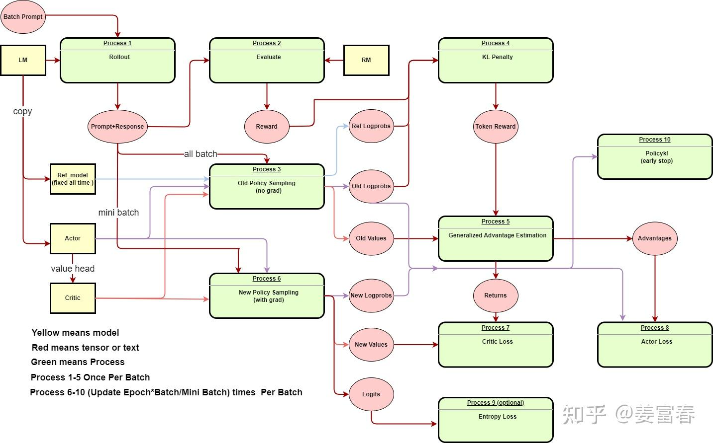
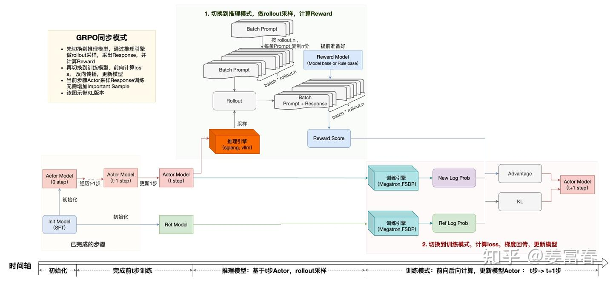
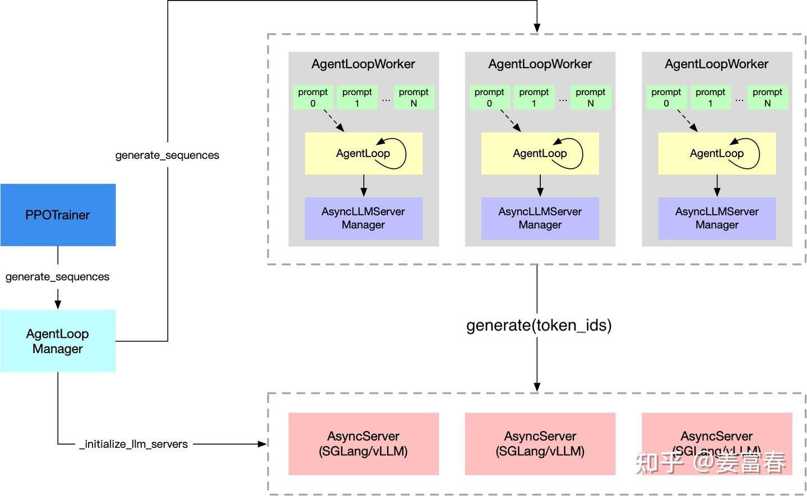
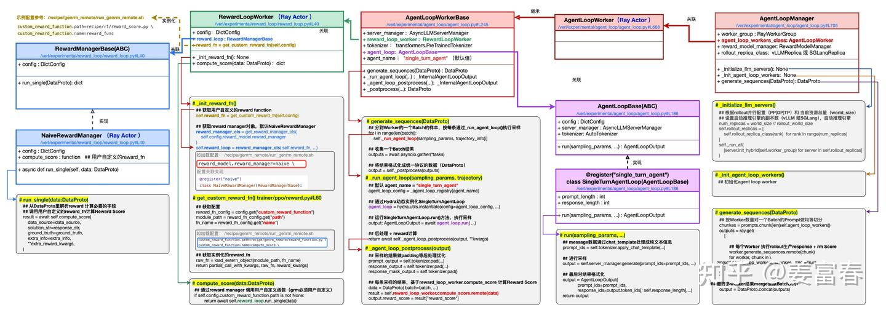

# PPO/GRPO 算法 + AgentLoop 架构

> 前三篇([flow.md](flow.md)、[rollout.md](rollout.md)、[ray.md](ray.md))讲的是 verl 的底层 infra——参数怎么搬、卡怎么切、数据流怎么编排。这一篇换个角度,讲两件互相关联的事:**RL 算法本身在算什么**(PPO/GRPO 的内部流程),以及 verl 在算法之上的应用接口——**AgentLoop 架构**——是怎么设计的。
---

## Part 1: RL

### 1.1 LM、Actor、Ref、Critic 是什么关系

PPO 这一套训练里有四个model(yellow block in diagram)

| 黄块 | 角色 | 怎么来的 | 训练中会变吗 |
|---|---|---|---|
| **LM** | 预训练 / SFT 母版 | 起点,所有人的来源 | 不进循环,只是 copy 给别人 |
| **Actor** | 策略模型,要训练的目标 | LM copy 一份 | **会变**🔥 |
| **Ref_model** | 参考模型,算 KL 约束用 | LM copy 一份,freeze❄️ | 全程不变 |
| **Critic** | 价值网络 | Actor 主干 + value head | **会变**🔥 |

两个细节:

**"value head" 是什么意思。** 一个普通 LM = Transformer 主干 + LM head(输出词表 logits)。Critic 把 LM head 换成 / 并排加一个 value head——一个很小的线性层,把每个 token 位置的 hidden state 映射成**一个标量 value**。所以图里 `Actor → value head → Critic` 的意思是"用 Actor 的模型结构再加个 value head 构造出 Critic"。

**为什么 LM 单独画出来。** LM 本身**不进训练循环**,它只是表达"Actor 和 Ref 同源"。第 0 步时 Actor = LM,从第一次更新开始 Actor 就漂走了,Ref 永远等于初始 LM。

---

### 1.2 三阶段:数据准备一次,参数更新多次

PPO 流程图里的 10 个 Process 正好对应你前面学过的三阶段框架,以及一个关键的计时规律:

- **Stage 1(生成)= Process 1 Rollout**:Actor + Batch Prompt → Prompt+Response。
- **Stage 2(准备训练数据)= Process 2~5**,图里标"Once Per Batch"——**一个 batch 只跑一次**:
  - Process 2 Evaluate:用 RM 打分 → Reward
  - Process 3 Old Policy Sampling(**no grad**):算 Ref Logprobs、Old Logprobs、Old Values
  - Process 4 KL Penalty:把 KL 揉进 reward → Token Reward
  - Process 5 GAE:Token Reward + Old Values → Advantages、Returns
- **Stage 3(训练)= Process 6~10**,图里标"`Epoch × Batch/MiniBatch` 次"——**多次跑**:
  - Process 6 New Policy Sampling(**with grad**):算 New Logprobs、New Values、Logits
  - Process 7/8/9 Loss(Critic / Actor / Entropy)
  - Process 10 PolicyKL early stop

这个"数据准备一次,参数更新多次"的节奏是 PPO 的灵魂。下面两节展开两个最容易被绕进去的点。

---

### 1.3 all batch vs mini batch:为什么要区分

图里两条标注值得专门看:

- `Prompt+Response` 用 **all batch** 喂给 **Process 3**(Old Policy Sampling)
- `Actor` 用 **mini batch** 喂给 **Process 6**(New Policy Sampling)

| | Process 3 | Process 6 |
|---|---|---|
| 喂多少数据 | all batch(整批) | mini batch(切小) |
| 跑几次 | 一个 batch 1 次 | 跑 `Epoch × Batch/MiniBatch` 次 |
| 有没有梯度 | no grad,纯前向 | with grad,要反向更新 |
| 目的 | 一次性备齐全 batch 的地基数据 | 反复多步更新参数 |

**Process 3 用 all batch**,因为它要为整批每条样本准备好 Old/Ref Logprobs、Old Values 这些"地基数据",一条不能少,而且 no grad 显存压力小,一把过就完了。

**Process 6 用 mini batch**,因为它要做 PPO 经典的"一批经验数据反复用几次":外层 epoch × 内层 mini batch,每个 mini batch 算一次 loss、更新一次参数。这是 PPO 样本效率的核心机制。

⚠️ verl 里其实有**三个粒度**——`train_batch_size`(all batch)、`mini_batch_size`(决定更新几次)、`micro_batch_size`(纯显存调节,梯度累积用,不影响更新次数)。图里只画了前两个。

---

### 1.4 GRPO

GRPO 是更轻量的算法,主要是把 PPO 里"重"的部分砍掉:

---

### 1.5 Ref Model 为什么放训练引擎,不放推理引擎

GRPO 流程图(上一节)里有个细节值得专门拎出来:**Actor 走两条路(推理引擎 + 训练引擎),Ref Model 只走训练引擎**。这是 RLHF 架构里 "engine 分工" 的核心。

| | 推理引擎(vLLM / SGLang) | 训练引擎(FSDP / Megatron) |
|---|---|---|
| 为什么存在 | 自回归生成优化(KV cache、PagedAttention) | 前向+反向,可选择只跑前向 |
| 强项 | "我不知道下一个 token,要 sample" | "整个序列我都知道,算一遍" |

**Ref Log Prob 在算什么?** 给定**已经生成好的** (prompt+response),问 ref model "你认为这串 token 每个位置的 log 概率是多少"——这是一次**纯前向**,不需要 sample、不需要 KV cache、不需要自回归。这种活推理引擎不擅长,训练引擎天然契合。

**为什么不把 Ref 也塞推理引擎:**
1. **显存浪费**——Ref 永远不变,占着推理引擎的位置纯粹挤压 Actor 的 KV cache。
2. **同步麻烦**——sharding manager 要把 Actor 训练侧参数搬到推理引擎,Ref 也放进去就要再做一套同步逻辑,但 Ref 不变,白做。
3. **数值对齐**——Ref Log Prob 要和 New Log Prob 算 KL,两者用同一套数值环境才干净。都在训练引擎里算精度自然对齐。
4. **Ref 不需要 sharding manager**——它就是个普通的冻结 FSDP 模型,不沾"训练 + 推理双重身份"的麻烦。

**一句话:"生成 token" 才需要推理引擎,"对已有 token 算概率" 用训练引擎就够。** 这不是 verl 的偏好,是 RL 训练逻辑决定的必然分工。

---

## Part 2:AgentLoop Architecture

### 2.1 为什么需要 AgentLoop:agent 不是单轮任务

前面学的 rollout 都是"一发完事":driver 把 batch 喂给 vLLM,vLLM 跑 generate,出来全部 response。但 agent 任务从根本上不是这样:

一个 agent rollout 内部有**状态**(走到第几轮)、有**外部副作用**(调工具)、有**变长结构**(几轮才结束不定)。原来那套"喂 prompt 拿 response"的接口根本表达不了。

更深一层,这背后只有**一个核心问题——batch-lockstep**:旧架构的循环单位是 batch 不是 sample,只要任何一个环节不齐步,最慢的就会拖垮最快的。它在 agent rollout 里表现成两种症状:

- **长度不齐**:有的样本 1 轮就结束,有的 10 轮。整批跑完第 t 轮才能进第 t+1 轮,快的只能等。
- **延迟不齐**:同一轮里有的工具 0.1 秒返回,有的 5 秒。整批工具都返回才能进下一次 generate。

AgentLoop 用一个 architectural shift 同时解掉这两个症状:**把工作单位从 batch 改成 sample,每条样本一个协程,各跑各的状态机**。

---

### 2.2 整体架构:三层调度

三层的频率差是关键:
- `PPOTrainer.generate_sequences`:**一个 RL step 一次**(可能几分钟)
- `AgentLoop`:**一条样本一份**(几十到几百份并发)
- `generate(token_ids)`:**每条样本每轮一次**(单条样本可能 5-10 次)

底层那个调用打到 server 上,可能成百上千次并发——这就是为什么 server 端需要 continuous batching。

---

### 2.3 类图:几个 Base 长什么样

类图看起来很满,但骨架其实只有几个关键类。读这种图的窍门是**先只看类名和继承箭头,代码片段全部跳过**。剥掉噪音后:

| 类 | 是什么 | 关键方法 | 子类例子 |
|---|---|---|---|
| `AgentLoopManager` | 顶层协调者(Ray Actor) | `generate_sequences`、`_initialize_llm_servers` | —— |
| `AgentLoopWorkerBase` | 调度容器基类 | `generate_sequences`、`_run_agent_loop` | `AgentLoopWorker` |
| `AgentLoopBase` (ABC) | 单条样本算法逻辑的抽象 | `run()` 是抽象方法 | `SingleTurnAgentLoop`、`MyToolAgentLoop` |
| `RewardLoopWorker` | reward 计算(Ray Actor) | `compute_score` | —— |
| `RewardManagerBase` (ABC) | reward 算法的抽象 | `run_single(data)` 是抽象方法 | `NaiveRewardManager`、自定义 |

**ABC(Abstract Base Class)** 是 Python 里"立规矩"的类——自己不能直接实例化,只能被继承。它定义一组必须实现的方法名(`@abstractmethod`),具体逻辑留给子类填。类比就是合同模板:写了"必须有 `run` 方法",但具体怎么 run 由签合同的子类填。

**两个 Base 的关系容易混,要记住:**

| | `AgentLoopBase` | `AgentLoopWorkerBase` |
|---|---|---|
| 是什么 | **算法**层抽象 | **调度**层基类 |
| 一个实例代表 | **一条样本**的 agent 逻辑 | **一组样本**的执行容器(Ray Actor) |
| 你要写的方法 | `run()` —— 这条样本怎么跑状态机 | 一般不动它 |
| 关心的事 | tool 调用、状态机、prompt 怎么拼 | 并发调度、跟 server 通信、调 reward |

**它们没有继承关系,是组合关系**:`AgentLoopWorker` 内部并发地创建多个 `AgentLoopBase` 子类实例。worker 是"老板",`AgentLoopBase` 实例是"打工的"——一个老板手下管几十个打工的同时干活。

**一句话:`AgentLoopBase` 定义"一条样本怎么跑",`AgentLoopWorkerBase` 定义"一组样本怎么并发跑";前者是算法,后者是调度;前者你要自己写,后者基本不用动。**

---

### 2.4 状态机:单条 AgentLoop 内部是什么样的循环

类图里那个 AgentLoop 框上的自循环箭头,展开就是这个状态机:

**每转一圈,就是一次 `generate(token_ids)` 请求打到 server**。自循环和"打底层 server 的箭头"是一件事的两个视角:控制流的回环 vs 对底层服务的多次请求。

为什么图里要画自循环、而不是把状态展开?因为从外面看,AgentLoop 就是一个**黑盒**——喂进去一个 prompt,自己内部转几圈,最后吐出一个 (prompt + 完整 trajectory)。外面只关心"它何时返回",不关心"它转几次"。一个自循环箭头就够表达这件事了。

---

### 2.5 为什么是 AsyncServer 不是嵌入式 vLLM

旧 rollout 把 vLLM 当对象嵌在 worker 里调用,新架构把它跑成独立 HTTP 服务进程(`AsyncServer`)。这个改造看起来是部署方式的变动,其实有几个深层理由:

**1. server 是协程化 rollout 的天然载体。** 要做到"A 等工具时 B 继续生成",`generate` 这个动作本身必须 awaitable——sync API 调用一句就会卡住整个 event loop。server 的 HTTP/RPC 接口天生 async。

**2. 共享权重 + 全局 batching。** N 个 worker 嵌 N 份 vLLM,模型权重内存里复制 N 份,而且每个 vLLM 的 continuous batching 只看到自己那一小撮请求,batch 打不满。改成 server 模式后所有 worker 的请求汇到同一组 server,**权重只存一份,batching 看到的请求池全局打满**。

**3. 部署灵活。** server 模式跟"线上 LLM 服务部署"是同一套栈——请求级中断、超时、重试、kv cache 复用,server 框架自带。库模式得自己造。

**4. 跨进程解耦。** server 可以放在和训练完全不同的机器/GPU 上,训练侧吃显存、推理侧吃算力时可以分开扩容。

`AsyncLLMServerManager` 是 worker 一侧的客户端,管路由(把请求按规则分给不同 server)、kv-cache 友好的 sticky routing(同一条样本的多轮请求尽量打到同一个 server)、连接池管理、协议屏蔽。

⚠️ 一个值得回去核对的点:**`AsyncServer` 进程和训练侧 Actor 是放在同一批 GPU(colocate)还是分开(disaggregated)**?colocate 下 sharding manager 仍然能做 P2P 零拷贝同步;分开放置则参数同步要走跨进程/跨机传输——这是新架构带来的工程选择,直接影响显存利用率和参数同步开销。

> 相关:[flow.md](flow.md) · [rollout.md](rollout.md) · [ray.md](ray.md)
