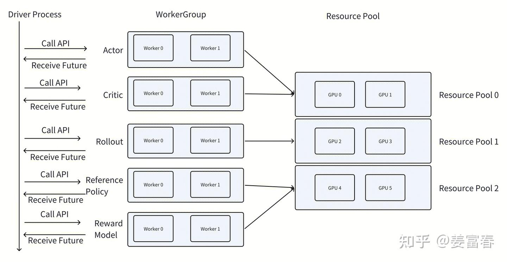
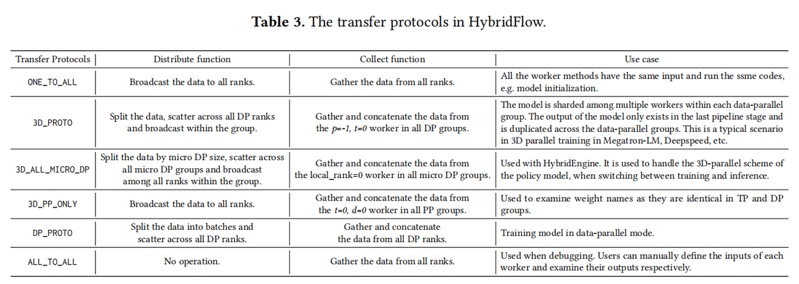
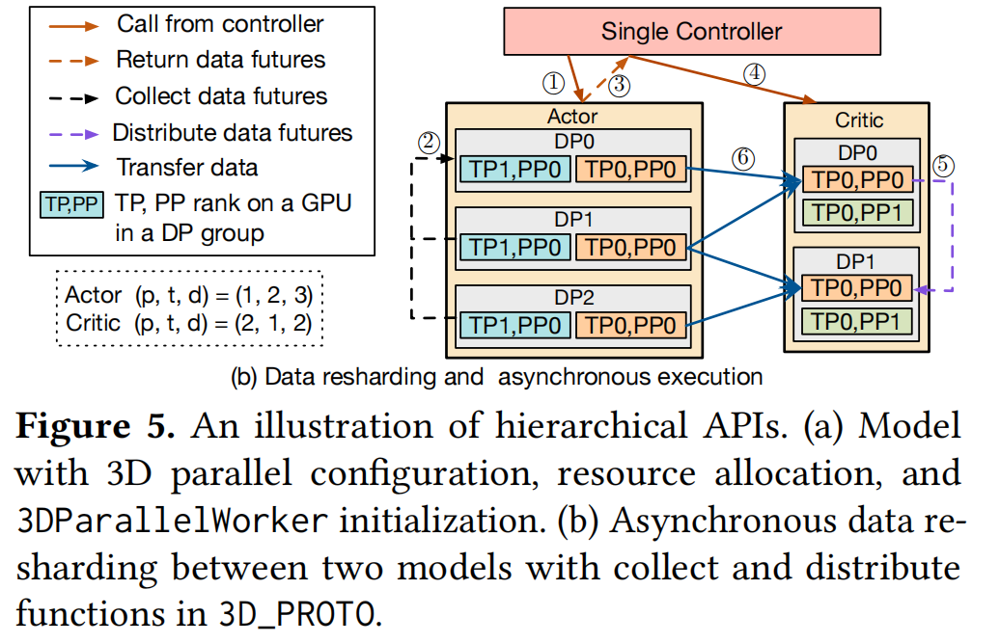

# verl 的 Ray:数据流与计算流的解耦

> 前两篇([flow.md](flow.md)、[rollout.md](rollout.md))讲的都是**计算流**这一侧——一个模型在 rollout 时参数怎么重排、FSDP 路径和 Megatron 路径各自怎么搬运。但那只是 verl 的一半。另一半是:四个角色(actor / critic / ref / reward)之间的数据怎么编排、怎么传递。SPMD 能撑住前者,撑不住后者——**这就是 verl 引入 Ray 的全部理由**。这篇补上缺口。

---

## 1. 为什么 SPMD 不够用:colocate vs 分开放置

RLHF 有四个模型、三个阶段(stage1 生成 response,stage2 准备训练数据,stage3 更新参数)。这四个模型怎么放进 GPU 集群,有两种思路。

**colocate**:四个模型摊平在同一批 GPU 上,每张卡里都有这四个模型的一部分。这种情况下纯 SPMD 就够用——放四个模型无非是把"放一个模型"的逻辑重复四遍,计算流和数据流都能复用现有 DP/PP/TP 那一套。stage1 算完的数据本来就在这张卡的显存里,stage2 直接读就行,**不存在跨集群搬运**。

**分开放置(disaggregated)**:把集群切成几块,actor 一块、critic 一块，每块只跑一个角色。好处就是并行度可以按角色独立设置(ref/reward 不需要 optimizer,没必要和 actor 共享并行度;早期大 critic 小 actor 也不用被迫共享);集群规模 scale up 时不用一味开高 DP,通信开销更小。坏处是会有资源闲置(stage1 时 critic 的卡在空转)。HybridFlow 论文第六章的 Auto Device Mapping 就是在搜一个效率最高的放置方案。

**关键矛盾出在分开放置上。** colocate 时只有计算时的通信(DP 的梯度 all-reduce、TP 的激活 all-gather);分开放置后多了一类通信——**把数据从一个角色传到另一个角色**(stage1->2 要把 actor 的输出传给 critic/ref/reward,stage2→3 要把结果传回 actor/critic)。这类"角色间数据搬运"用 SPMD 写非常别扭:SPMD 的前提是所有进程跑**同一份代码**,但 actor 集群和 critic 集群跑的根本不是一个程序。硬在 SPMD 内部塞跨角色通信,还容易把反向传播的计算图搞断。

> 所以总结来看**SPMD 适合对称的计算流,处理不对称的角色间数据流就力不从心了。**

---

## 2. 核心思想:single-controller + multi-controller

HybridFlow 把这件事拆成两个controller

**multi-controller(Ray worker)= 管计算流。** 每个 worker 内部仍然是纯 SPMD:该 FSDP 用 FSDP,该 Megatron 用 Megatron,按 rank 领自己的 weight 和 data,到点了通信一下。没有调度者,worker 自驱。

**single-controller(Ray driver)= 管数据流。** driver 站在上帝视角,掌管全局的一个"大 batch",主动调度任务、编排工作流。它的代码长得像伪代码:

```python
batch = actor_workers.generate(prompts)          # 让 actor 集群干活
values = critic_workers.compute_values(batch)    # 把结果发给 critic 集群
log_probs = ref_workers.compute_log_prob(batch)  # 发给 ref 集群
...
actor_workers.update(batch)                      # 训 actor
```

**解耦带来的收益:**

- 对 driver 来说,模型怎么 infer、怎么 train 都是黑盒,它只编排顺序和数据流。
- 对 worker 来说,内部有独立的分布式环境,不用担心别的逻辑扰乱它的 SPMD 范式,可以充分复用 pretrain / sft 积累的分布式优化经验。
- 想试新的 RLHF 算法,改的是 driver 那层轻量逻辑,不用碰分布式计算;想优化分布式效率,改 worker 内部,不用担心改坏算法。**两边可以独立演进。**

代价是 RPC 带来的一点 overhead,但换来"算法同学不用和 SPMD 范式打交道"——以前没有 Ray 时,魔改最常见的 bug 就是破坏 SPMD 同步:某个 rank 多做了一次 random,random state 出问题;某个 tensor 的 shape 没对齐,broadcast 时整个卡死。这笔账非常划算。

---

## 3. Ray worker 不是免费的:`num_gpus` 的坑

引入 Ray 后,执行计算的对象从"torchrun 拉起的进程"变成了"Ray worker"。这里有两个容易踩的坑。

### 3.1 `ray.remote(num_gpus=4)` 用不上多卡。
直觉上以为申请 4 张 GPU 的 Actor 就能用 4 卡了,其实不行——一个 Ray Actor 本质是**一个 Python 进程**,`num_gpus=4` 只是让它能看见 4 张卡,但它还是单进程。要用上得自己在内部 `multiprocessing.spawn` 拉子进程,等于把 torchrun 干的事重写一遍,而且 FSDP/Megatron 的现有代码也复用不上。

正确做法:**开 N 个 `ray.remote(num_gpus=1)` 的 worker,每个绑一张卡,内部各自 `init_process_group` 组成 NCCL 通信组**——这下就和 torchrun 拉起的 N 个进程完全等价了。注意一个区别:torchrun 版每个 rank 完整跑整段代码,`init_process_group` 可以写在外面;Ray 版每个 worker 只跑 class 里的代码,所以 `init_process_group` 要写进 class 内部,环境变量(WORLD_SIZE / RANK / MASTER_ADDR / MASTER_PORT)也要手动配。

### 3.2 colocate 时`num_gpus=0.5` 会报 `Duplicate GPU detected`。
想让两个模型共享一批卡,每个 worker 占半张卡,写 `num_gpus=0.5`——结果 Ray 可能把同一个模型的 rank0 和 rank1 都塞进 GPU0(各占一半),而不是分别放在 GPU0 的一半和 GPU1 的一半。两个 rank 撞一张卡,SPMD 的 NCCL 通信组直接崩。

根因:`num_gpus` 只能表达"占多少",不能表达"占哪张"。

解法是 verl 的 `RayResourcePool`:先把集群资源切成若干 **bundle**(每个 bundle = 1 张 GPU),注册成 placement group;启动 worker 时用 `placement_group_bundle_index` **精确点名**放进哪个 bundle。这样既能让多个模型 colocate 在同一批卡上,又能保证同一个模型的各 rank 落在不同的物理 GPU 上。本质上是从"我要资源"升级成"我要**这一块特定的**资源"。

---

## 4. WorkerGroup:把一组 worker抽象出来



既然一个角色不再是一个对象、而是**一组各占 1 GPU 的 worker**,就需要一套东西来统一管理它们——这就是 `RayWorkerGroup`。对 RL 里的每个 role(actor/critic/ref/reward),都有一组 ray worker + 一组 GPU 构成对应的 WorkerGroup。在最简化的 demo 里,WorkerGroup 就是一个 `List[Worker]`,verl 的实现接口更干净,但定位一样。

每个 `RayWorkerGroup` 初始化要传两样东西:

- **`resource_pool`**:就是上面讲的 PlacementGroup,这组 worker 要用哪些机器资源。
- **`ray_cls_with_init`**:对用户写的 worker class 简单魔改了 `ray.remote` 拉起 worker 的逻辑,把 PlacementGroup 的配置塞进 `options` 里。

用户要写的 worker(verl 里的 `ActorRolloutRefWorker` / `CriticWorker`)本身和 SPMD 写法别无二致:初始化模型,封装成对应角色,能做相应角色的计算(actor 在 stage2 算 logprobs、stage3 做 update;critic 在 stage2 算 values、stage3 做 update)。唯一不同的是——需要暴露给 driver 调度的方法,要加 `@register(dispatch_mode)` 装饰器。

---

## 5. `@register` + `_bind_worker_method`:数据流的"预制菜"

这是整个机制最有意思的部分,解决一个具体问题:**driver 传的是完整 batch,但 worker 的方法是为"自己那份数据"写的,中间的 split / gather 谁来做?**

**`@register` 其实"什么都没做"。** 看代码,`inner` 几乎原样调用 `func`,它唯一干的实事是 `setattr(inner, MAGIC_ATTR, attrs)`——给函数贴一张"便利贴",上面记着 `dispatch_mode / execute_mode / blocking` 三个字段。`@register` 不处理数据,只是做个标记、留个说明书。

为什么分两步(先贴标签、后处理)?因为贴标签发生在**定义类的时候**,而真正绑定数据流逻辑要等到**创建 WorkerGroup 的时候**——那时才知道这个 group 有几个 worker、资源池多大。

**真正干活的是 `_bind_worker_method`**,在 `RayWorkerGroup` 初始化时被调用,做三件事:

1. **扫描**:遍历用户 worker class 的所有方法,挑出贴了 `MAGIC_ATTR` 的。
2. **查菜单**:根据便利贴里的 `dispatch_mode`,从 verl 预制好的表里查出对应的 `dispatch_fn`(怎么把 driver 输入切给各 worker)和 `collect_fn`(怎么把各 worker 输出合并)。这就是"预制菜"——DP 的 split/gather、TP 的广播,verl 已经写好放在菜单里,按 `dispatch_mode` 点菜即可。
3. **包装替换**:用 `func_generator` 把原方法包成一条流水线,再替换掉原方法:

```python
def func(*args, **kwargs):
    args, kwargs = dispatch_fn(self, *args, **kwargs)  #分发:完整输入 → 切好分给各 worker
    output = execute_fn(method_name, *args, **kwargs)   #执行:所有 worker 并行跑这个方法
    if blocking:
        output = ray.get(output)                        #等结果:future → 真实数据
    output = collect_fn(self, output)                   #收集:各 worker 输出 → 合并成一个
    return output
```

**效果:** 用户写 worker 只写纯 SPMD 计算逻辑("我这个 rank 怎么算我那份");driver 调用只管"传完整数据、收完整结果"。中间所有 split / gather / 广播的脏活,被这套装饰器机制用可复用的预制菜自动填上了——不用为每种并行模式都手写一遍相似的数据处理代码。

HybridFlow 论文 Table 3 把这些"预制菜"列得很清楚——每种 transfer protocol 对应一对 distribute / collect 函数,以及典型 use case:



> ⚠️ 自己核对:`dispatch_mode` 具体有的枚举值(`ONE_TO_ALL` / `DP_COMPUTE` / `ALL_TO_ALL` 等)在 `verl/single_controller/base/decorator.py` 里面

---

## 6. ObjectRef 与异步执行

driver 在 worker group 之间传递的不是原始 Tensor,而是 **`ray.ObjectRef`(数据的pointer)**。driver 全程传pointer, m不传真实数据,只在最后才 `ray.get`。

收益是**异步**:driver 调完 `.remote()` 立刻返回、不阻塞,可以飞快地把整个工作流(call actor → collect → call critic → distribute → ...)编排完,Ray 在后台根据依赖关系自动调度执行。`ray.get` 的阻塞被推迟到 worker 内部和最末尾。

这正是 HybridFlow 论文 Figure 5(b) 画的东西。两个并行配置不同的模型——Actor `(p,t,d)=(1,2,3)`、Critic `(p,t,d)=(2,1,2)`——之间的数据 resharding:



1. **Call from controller**:单控制器对 Actor 发起调用。
2. **Collect data futures**:Actor 各 DP 组算完,controller 把各组输出的 **future** 收集起来(收的是引用,不是真 tensor)。
3. **Return data futures**:future 返回给 controller,数据本身还在 Actor 的 GPU 上没动。
4. **Call from controller**:controller 转头调用 Critic。
5. **Distribute data futures**:把第 ③ 步的 future 分发给 Critic 各 DP 组,告诉每个 worker"你要的数据在 Actor 的哪几块 GPU 上"。
6. **Transfer data**:Critic 的 worker 根据引用,**直接从 Actor 对应的 GPU 拉数据**。

最精妙的是 ⑥ 的连线——Actor 切成 3 份(DP=3),Critic 要切成 2 份(DP=2),3 份重组成 2 份必然是**多对多交叉传输**,每条线还顺带处理 TP→PP 的布局转换。而这个"该发给谁"是各 worker 自己算出来、点对点直传的,**不经过 controller 中转**。

所以这张图就是"数据流与计算流解耦"的官方示意:**controller 只碰轻量的 future(虚线),沉重的数据 resharding 由 worker 之间直连完成(蓝实线),两者互不干扰。**

---

## 7. 和flow.md & rollout.md 的关系

| | 计算流(前两篇) | 数据流(本篇) |
|---|---|---|
| 对应概念 | multi-controller / SPMD | single-controller / Ray driver |
| 解决什么 | 单个角色内部怎么算、参数怎么重排 | 多个角色之间怎么编排、数据怎么传 |
| 代码长什么样 | FSDP / Megatron / vLLM 的 SPMD 逻辑 | driver 里像伪代码的工作流 |
| 谁来改 | infra 同学优化分布式效率 | 算法同学迭代 RL 算法 |

两半合起来才是完整的 HybridFlow。再串一遍核心结论:

- **colocate 用 SPMD 就够**,分开放置才需要 Ray——Ray 是来处理"角色间数据搬运"这个 SPMD 不擅长的事的。
- **Ray worker 承载 SPMD,不替代 SPMD**:worker 内部还是 `init_process_group` + 集合通信那一套,Ray 替代的是 torchrun "拉进程 + 配环境变量"那部分工作。
- **verl 在这一层的贡献**:把数据流逻辑做成 `@register` 预制菜 + `WorkerGroup` 抽象,让上层用户只改 driver 的伪代码逻辑就能实现新 RL 算法,不用深入 worker 去和 nccl hang 死磕。

最后呼应一下原文的碎碎念:随着 GRPO 砍掉 critic、可验证任务(数学/代码)砍掉 reward model、近期工作连 ref model 都想砍掉,RLHF 流程正在大幅简化。模型少了、角色少了,"分开放置"的必要性可能下降,未来是否会回到以 SPMD 为主的范式,尚未可知——但理解 Ray 这套"数据流 / 计算流解耦"的设计思路,价值不会过时。

---

> 相关:[flow.md](flow.md) · [rollout.md](rollout.md)
