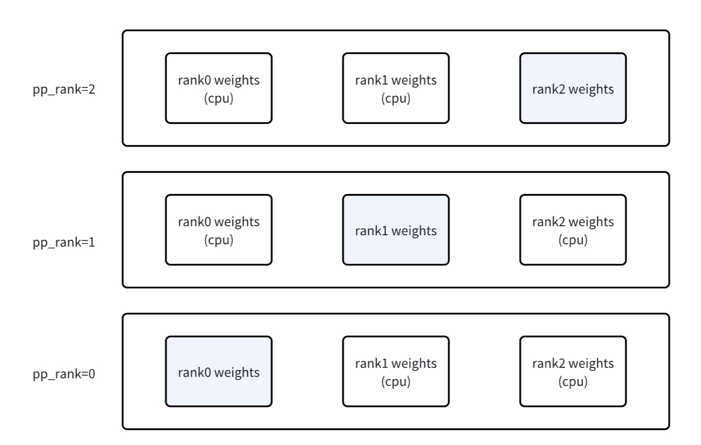
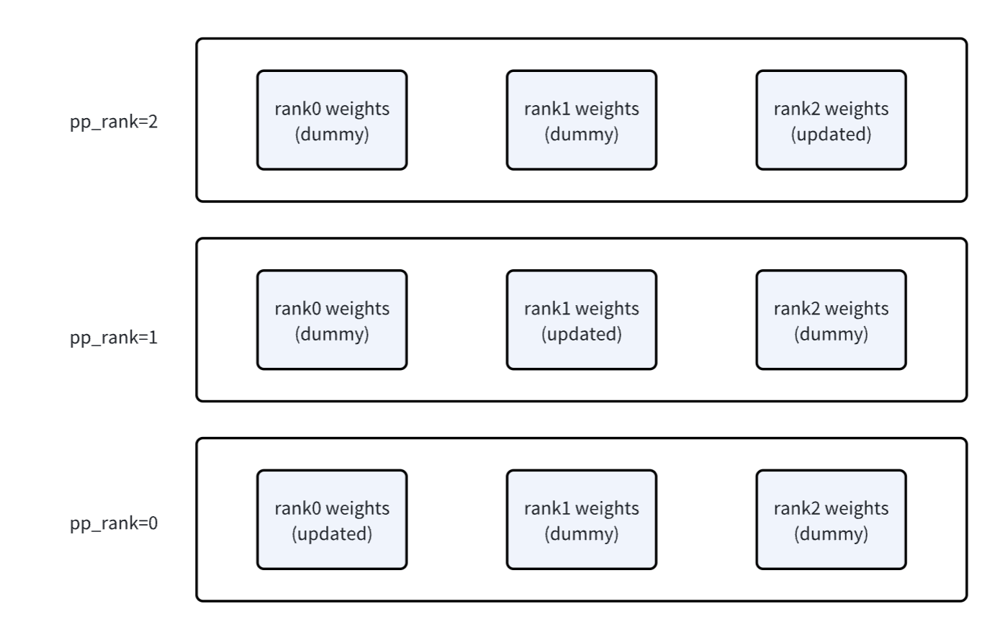
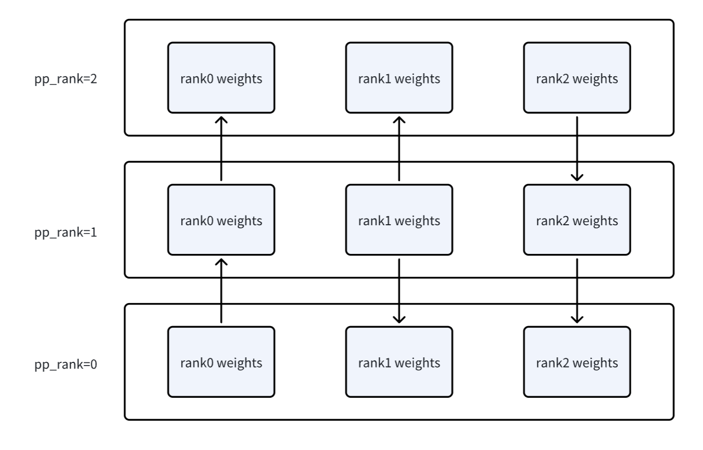
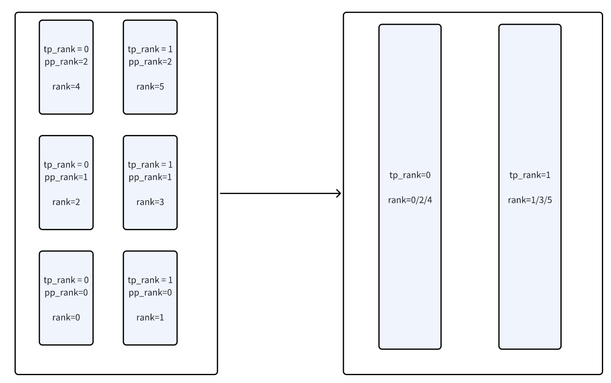
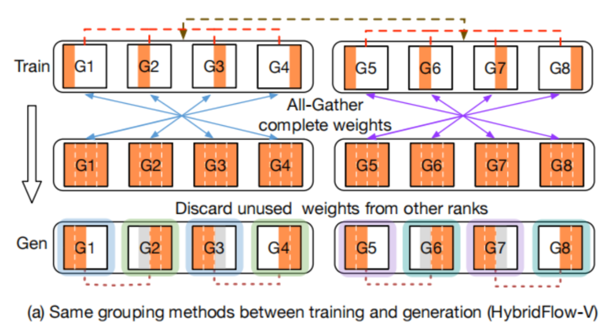
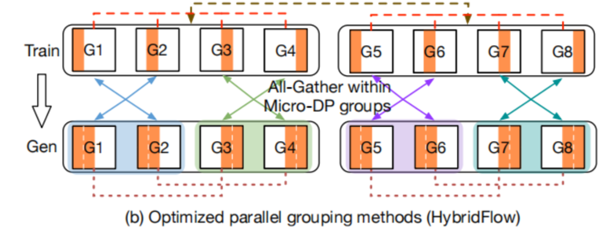

# verl Rollout 优化:从 FSDP 到 Megatron 的两条路径

## 背景:为什么 RLHF 需要一个 sharding manager

做 RLHF(PPO、GRPO 这类)的每一步训练循环本质上是两阶段:先让模型生成一堆答案(rollout),再根据答案的好坏更新参数(train)。听起来简单,真做起来才发现这两阶段对"模型"的需求是完全相反的。训练阶段要算梯度、要存优化器状态、要保留激活,所以习惯用 PyTorch + FSDP/Megatron 这一套;推理阶段要打高吞吐、要用 KV cache、要做高效采样,所以更适合 vLLM 这种专门的推理引擎。

问题就出在这里——两个阶段都需要"同一个模型",但训练框架和推理框架对参数怎么切、放在哪、命名规则是什么,**完全不一样**。每步训练完都要把刚训完的参数搬给 vLLM,搬完才能开始 rollout;rollout 完又得把数据接回来训练。中间这一道"搬运"——既要正确,又要省显存,还要快——是 RLHF 工程里最脏最难的一块,verl 把这块封装成了 `ShardingManager`,核心代码就是我们要讨论的两个文件。

verl 提供了两条独立的实现路径:**FSDP 路径**(用于训练侧用 PyTorch FSDP 的场景)和 **Megatron 路径**(用于训练侧用 Megatron 3D 并行的场景)。两者解决的本质问题一样,但具体做法和优化深度差别很大。

---

## Part 1:FSDP + vLLM 路径

### 问题的本质

训练侧用 FSDP 的 FULL_SHARD(等同 DeepSpeed ZeRO-3)时,每张卡只保留 `1/world_size` 的参数碎片——8 卡机器上每张卡只有 1/8 的模型参数。推理侧 vLLM 用 TP=4 时,要求每张卡持有完整模型的 1/4 切片(按 vLLM 自己的切分规则)。这就意味着 FSDP 的"按 N 切碎"和 vLLM 的"按 TP 维度切片"是两套完全不兼容的参数布局,中间必须先拼成完整参数,再按 vLLM 的规则重新分配。

这件事还连带几个小问题:开源模型(HuggingFace 风格)和 vLLM 内部模型实现并不一一对应,比如 q/k/v 在 HF 是分开三个矩阵,vLLM 是合并的 qkv 单矩阵;参数名也不同。所以参数搬运还附带一道"翻译"工序。

### 三道难题用快递员比喻最好懂

把整个搬运过程想象成快递投递。第一道难题是**地址簿不一致**——vLLM 的参数命名规则和 actor model 不同,需要一份针对每种模型(llama、gpt2、deepseek 等)手写的"翻译表",verl 里把它们叫 `xxx_dtensor_weight_loader`。

第二道难题是**分箱规则不同**——训练时 FSDP 把参数拆成 8 个碎片,推理时 vLLM 要求按它自己的规则分 4 箱。所以要先把 8 个碎片拼回完整参数,再按 vLLM 的方式重新分装。具体到 ColumnParallelLinear 沿 dim 0 切,RowParallelLinear 沿 dim 1 切,每个 TP rank 用 `narrow()` 取自己那一段。

第三道难题是**运输通道限制**——FULL_SHARD 切出来的不是规整 tensor,得先调 `full_tensor()` 拼完整,这一步本身又会临时占一大块显存。所以同步完必须立刻 `del` 加 `empty_cache`,不然下一阶段就 OOM 了。

### 实际流程

进入 rollout 的 `__enter__` 时,先调 `module.state_dict()` 拿当前 rank 上的参数(还是 FSDP 切碎状态),用 `full_tensor()` 拼成完整张量,通过翻译表把参数名换成 vLLM 认的名字,然后调 `inference_engine.sync_model_weights()`。这一步内部就是遍历完整参数 dict,对每个参数找到 vLLM model 里对应的 module,调 module 自带的 `weight_loader` 做切片 + copy_。

举个具体例子:假设有一个 `[16, 16]` 的 RowParallelLinear 参数,在 TP=4 下沿 dim=1 切成 4 个 `[16, 4]` 子张量。8 张卡的 world_size 配上 TP=4,正好形成 dp=2 × tp=4 的布局——rank 0-3 拿到第一份完整模型(每张卡持有完整参数的 1/4),rank 4-7 拿到第二份完整模型。这意味着推理时同时有两份独立模型在跑,可以处理两份不同输入,吞吐翻倍。

### 工程细节才是真正的难点

搬运完参数只是第一步,要让整个 pipeline 真正跑起来还有一堆事。**显存管理**上,同步完立刻 del + empty_cache 释放临时显存;vLLM model 本身初始化后就 offload 到 CPU,只在用时才搬回 GPU;rollout 结束后再 offload 回去并清 KV cache 引擎,把显存全部让给训练阶段。这一套 offload + empty_cache 的操作看着繁琐,但相对 generate 几十秒上百秒的耗时,几秒的搬运完全可以接受,换来的是能开更大 batch、能降低并行度——是稳赚不赔的交易。

**随机数同步**是另一个隐藏坑。vLLM 在 sample token 时要用随机数,而 TP=4 的 4 张卡是协作算同一份模型的同一次 forward,如果各自 sample 出不同 token,下一步 forward 就乱套了。所以同 TP group 内所有 rank 必须用相同的随机数 seed——verl 用 `gen_dp_rank + 1000` 做 seed,保证同一个 DP group 内的 4 个 TP rank 拿到一样的随机状态,而且只在 `__enter__` 时切换,`__exit__` 时切回原来的 torch_random_states,不污染训练。

**数据打包**同样关键。训练时是 DP=8,8 张卡各拿 4 条不同数据;推理时是 dp=2 tp=4,TP 内的 4 张卡必须接收相同输入(因为它们协作算一份模型)。verl 的做法是把 rank 0-3 的数据 concat 起来当作那份 vLLM 模型的输入,batch_size 从 4 涨到 16;rank 4-7 同理。generate 完成后再切成 4 份小块发回给原本的 8 个 rank,这样后面 DP=8 阶段每个 rank 又有不同数据了。

### 这条路径的总结

FSDP 路径的核心套路是**"拼完整 → 翻译命名 → 按 vLLM 切片 → 谨慎管理显存"**。FSDP 那种"参数按 N 切碎"的方式决定了 vLLM 必然要拿一份独立的显存(因为 full_tensor 是临时拼出来的,vLLM 必须 copy_ 一份留下来用),这是这条路径不可避免的开销。但好处是实现相对简单,适合中小模型(单机能放下完整模型的场景)。

---

## Part 2:Megatron + vLLM 路径(3D HybridEngine)

### 为什么 Megatron 这块更复杂

Megatron 训练时用的是 3D 并行——TP、PP、DP 三种切法叠加。比如 8 卡可以配 TP=4 PP=2,意思是 4 张卡协作算一份模型(TP),整个模型再切成两段流水线(PP),没有 DP 维度。这种切法在训练时很划算,因为反向传播能填满流水线的 bubble、激活也省了大块显存。

但推理阶段不一样。**vLLM 几乎只用 TP,不用 PP**。原因两条:第一,PP 把模型切成串行的几段,每张卡要等前一段算完才能干活,训练时有反向能填,推理只有前向,bubble 抹不掉,大半时间 GPU 在等;第二,常规缓解 bubble 的办法是切 micro-batch,但 decoding 阶段本来就是 memory bound,batch 必须打大才划算,切小了反而更慢。所以做 Megatron + vLLM 时,**PP 维度在推理阶段必须消失**。

更进一步,训练时设的 TP=4 是因为要给 optimizer state、gradient、激活留位置,显存吃紧;推理时这些都不要,显存全留给 KV cache 就行,可以**降低 TP 维度提高 DP**——同样 8 卡,从 TP=4 PP=2(1 份模型)变成 TP=2 DP=4(4 份模型并行),吞吐能涨好几倍。

这就引出了 verl 在这条路径上的核心设计:**actor 和 rollout 的并行配置应该独立设置**,中间靠 sharding manager 做两步重排——先把 PP 维度压成 DP,再把 TP 降级换成更多 DP。

### Step 1:用 AllGatherPPModel 把 PP 压成 DP

要消除 PP 维度,本质上得让每张卡都拿到完整模型(在 TP 切分下,意思是拿到自己 TP rank 那一片的所有 layer)。一个朴素做法是 rollout 时遍历每个参数挨个 broadcast 到所有 PP rank,但这样通信粒度太细、效率很差。

verl 想了个更优雅的做法:`AllGatherPPModel`。在**初始化模型时就动手脚**——一般的做法是每个 PP rank 只构建自己负责的那段 layer,verl 反过来,**让每个 PP rank 都把所有 PP rank 的 layer 都建出来**,只是非自己的部分先放空 tensor 占位。每段 layer 的参数用一整块连续显存(`MemoryBuffer`)统一管理,这样后面通信、offload、`.cuda()` 这些操作能整块整块来,不用逐 tensor 调,效率高得多(思路和 DDP 的 gradient bucket 一致)。

非本 rank 的占位空间初始化后就 offload 到 CPU,省显存;真正训练时只用自己 rank 的部分。初始化完成后的布局如下——每个 PP rank 只在 GPU 上保留自己那段 layer,其他段都 offload 到 CPU:



训练若干步以后,每个 rank 上只有自己那段是 updated 的,其他段还是初始化时的 dummy 值:



rollout 开始进入 `__enter__` 时,先把其他 PP rank 的占位空间从 CPU 搬回 GPU(此时填的是 zeros,因为上一轮 rollout 的旧值已经过时,不值得 copy),让 weight 变量重新指向 MemoryBuffer 里对应的 slice。然后**做一次 PP rank 间的 allgather**:rank 0 把自己持有的 layer 0-15 广播给其他 PP rank,rank 1 把 layer 16-31 广播回来,通信结束后**每张卡都有完整模型的参数**:



这一步走完,布局就从训练时的 TP × PP(只有 1 份模型)变成了 TP × DP(多份完整模型并行),PP 维度消失。比如 6 卡 TP=2 PP=3,allgather 后变成 TP=2 DP=3——同 TP rank 的所有卡合并成一个 DP group,持有完整模型在 TP 切分下的同一片:



### 指针共享显存:这条路径相对 FSDP 路径最大的红利

到这里有个关键设计值得单独讲。把 actor 的完整参数喂给 vLLM 时,Megatron 路径用的不是 copy,而是**指针赋值**:

```python
param.data = loaded_weight.data    # Megatron 路径
```

对比 FSDP 路径的 `param.data.copy_(loaded_weight)`,这一行意味着 vLLM 的 param 和 actor 的 param **指向同一块物理显存**——vLLM 完全不需要额外的显存空间,所有参数都白嫖 actor 的。

这件事能做成,前提是 MemoryBuffer 把参数布局得整齐、连续、所有权清晰,actor 和 vLLM 对同一块显存的 layout 达成共识。FSDP 那条路径之所以做不到,是因为 ZeRO-3 切碎的参数必须用 `full_tensor` 现场拼出来,拼出来的是临时显存,vLLM 不 copy 一份就拿不到——这是 ZeRO-3 切法的天生限制。

所以这条 Megatron 路径,**vLLM 模型完全零额外 GPU 显存开销**——这是 verl 在 RLHF 工程里最实在的省显存招数。

### Step 2:把 TP=4 降级到 TP=2,通信量再减半

PP→DP 之后是 TP=4 DP=2,还有进一步压缩的空间。把 TP 从 4 降到 2,意味着每张卡要从"持有完整模型的 1/4"变成"持有完整模型的 1/2",DP 就能从 2 涨到 4——4 份模型并行,吞吐再翻倍。

降级时每张卡要去隔壁卡那里"借"一片参数,自然要做一次 TP group 内的 allgather。但这里有个 Megatron 默认切分顺序导致的麻烦。Megatron 默认 TP 优先级高于 DP,所以 TP=4 的 4 张 rank 的参数分布是 `[m_0]`、`[m_1]`、`[m_2]`、`[m_3]`(rank 0 到 rank 3 依次)。降到 TP=2 时,理想情况下 rank 0 和 rank 1 一组合并出 `[m_0, m_1]`,rank 2 和 rank 3 一组合并出 `[m_2, m_3]`,通信只发生在相邻 rank 之间。

但 Megatron 默认的 group 划分是 rank 0 和 rank 2 一组、rank 1 和 rank 3 一组(因为它优先按 TP=2 把 rank 配对),这就尴尬了——rank 0 持有 `m_0`,rank 2 持有 `m_2`,两个不挨着的位置,合不出 `[m_0, m_1]`,必须做一次**全量 allgather** 再切片,通信量是必要的两倍。HybridFlow 论文里把这种"训练和推理沿用同一个 group 划分"的方案画了出来——allgather 必须跨所有 rank,再把不属于自己的部分丢掉:



verl 的做法是**反转切分优先级**,让 TP < DP,重新构建一个 `MICRO_DATA_PARALLEL_GROUP`,让 rank 0 和 rank 1 真的成为一组、rank 2 和 rank 3 真的成为一组。这样通信只在相邻两 rank 之间发生,**通信量减半**。这是个工程上很小但很巧的优化:



模型这边降级完,数据这边也要相应调整。原本 TP=4 时 4 张卡接收相同输入,现在 TP=2 时只有 2 张卡接收相同输入——所以要把原来的合并输入按新的 micro_dp_group 重新切成 4 份,generate 完成后再 allgather 拼起来,保持外层数据流的一致。

### dp 增减的通用套路

把这两步走下来,你会发现一个通用规律,verl 文档自己也提了:**dp 维度减小就要 gather,dp 维度增加就要 chunk**。模型从"分散的多份"合并成"集中的少份"时,要把碎片拼起来(gather);数据从"集中的少份"切给"分散的多份"时,要把数据切开(chunk)。这条规律不只在 verl 里,任何"训练拓扑 → 推理拓扑"的转换都成立,以后做类似系统时背下来即可。

---

## 两条路径的对比和选择

|  | FSDP 路径 | Megatron 路径 |
|---|---|---|
| 训练侧 | PyTorch FSDP(ZeRO-3) | Megatron 3D 并行(TP+PP+DP) |
| 参数同步方式 | `full_tensor` 拼完整 → `copy_` 到 vLLM | `allgather` 合并 → 指针共享给 vLLM |
| vLLM 额外显存 | 需要一份 | 零额外 |
| 实现复杂度 | 中等 | 高(还要处理 PP→DP 和 TP 降级) |
| 适用场景 | 中小模型,单机能放下 | 超大模型,必须 3D 并行 |
| 通信优化 | 主要靠 offload + empty_cache | 还多了 MICRO_DATA_PARALLEL_GROUP 之类的微调 |

简单说,如果模型不太大,单机 8 卡能放下,FSDP 路径足够用——简单、可靠、显存代价可控。如果模型大到必须开 PP(比如 DeepSeek-V3 这种连单机 TP=8 都装不下的),那就只能走 Megatron 路径,顺便享受指针共享显存的红利。

---

## verl 真正的贡献是什么

- **3D HybridEngine 架构**(对应 HybridFlow 论文)——把 Megatron 训练和 vLLM 推理用最少的显存代价接起来,中间靠 sharding manager 做参数布局重排,这是 verl 区别于 OpenRLHF、TRL 等其他 RLHF 框架的最大卖点。
- **AllGatherPPModel 的预分配设计**——不是简单 broadcast 一次同步参数,而是初始化时就给所有 PP rank 留好位置,allgather 一次到位,顺便配上 MemoryBuffer 把通信粒度从"逐 tensor"提升到"整块连续显存"。
- **TP/DP 切分优先级反转**——通过重建 `MICRO_DATA_PARALLEL_GROUP` 让通信组对齐,把 TP 降级时的通信量减半。

剩下的东西——FSDP 那段、随机数同步、数据 chunk/gather、显存 offload——是 RLHF 工程的通识,所有做这块的人都会遇到。verl 的功劳是**把这些细节都整理清楚、做成干净的 context manager 抽象**,让上层用户只要写一句 `with sharding_manager: rollout.generate()` 就能跑通,不用每次自己处理一堆暗坑。

看 verl 主要是学这件事——**怎么把训练框架和推理框架两个完全不同生态的并行系统对接起来**。这是任何 RLHF 系统都绕不开的核心难题,verl 给了一个目前看来最完整的答案。
